# MEGA DIAGRAMA — Easy e-Social → CPF 08132588983

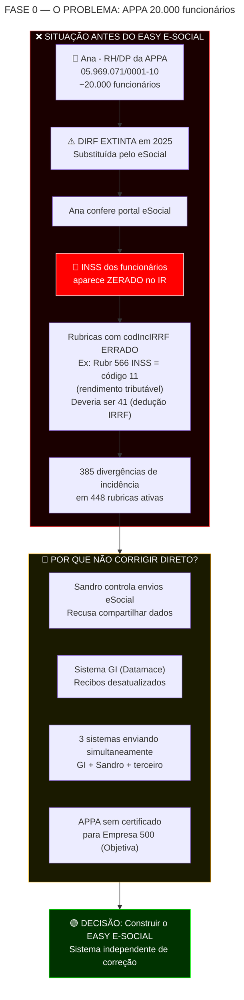
```mermaid
---
title: "FASE 0 — O PROBLEMA: APPA 20.000 funcionários"
---
flowchart TB
    subgraph ANTES["❌ SITUAÇÃO ANTES DO EASY E-SOCIAL"]
        ANA["👩 Ana - RH/DP da APPA\n05.969.071/0001-10\n~20.000 funcionários"]
        DIRF_FIM["⚠️ DIRF EXTINTA em 2025\nSubstituída pelo eSocial"]
        ANA --> DIRF_FIM
        DIRF_FIM --> PORTAL["Ana confere portal eSocial"]
        PORTAL --> BUG["🔴 INSS dos funcionários\naparece ZERADO no IR"]
        BUG --> CAUSA["Rubricas com codIncIRRF ERRADO\nEx: Rubr 566 INSS = código 11\n(rendimento tributável)\nDeveria ser 41 (dedução IRRF)"]
        CAUSA --> ESCALA["385 divergências de incidência\nem 448 rubricas ativas"]
    end

    subgraph BLOQUEIOS["🚫 POR QUE NÃO CORRIGIR DIRETO?"]
        SANDRO["Sandro controla envios eSocial\nRecusa compartilhar dados"]
        GI["Sistema GI (Datamace)\nRecibos desatualizados"]
        TRES_SIS["3 sistemas enviando simultaneamente\nGI + Sandro + terceiro"]
        SEM_CERT["APPA sem certificado\npara Empresa 500 (Objetiva)"]
    end

    ESCALA --> BLOQUEIOS
    BLOQUEIOS --> DECISAO["🟢 DECISÃO: Construir o EASY E-SOCIAL\nSistema independente de correção"]

    style ANTES fill:#1a0000,stroke:#ff4444,color:#fff
    style BLOQUEIOS fill:#1a1a00,stroke:#ffaa00,color:#fff
    style BUG fill:#ff0000,stroke:#fff,color:#fff
    style DECISAO fill:#003300,stroke:#00ff00,color:#fff
```

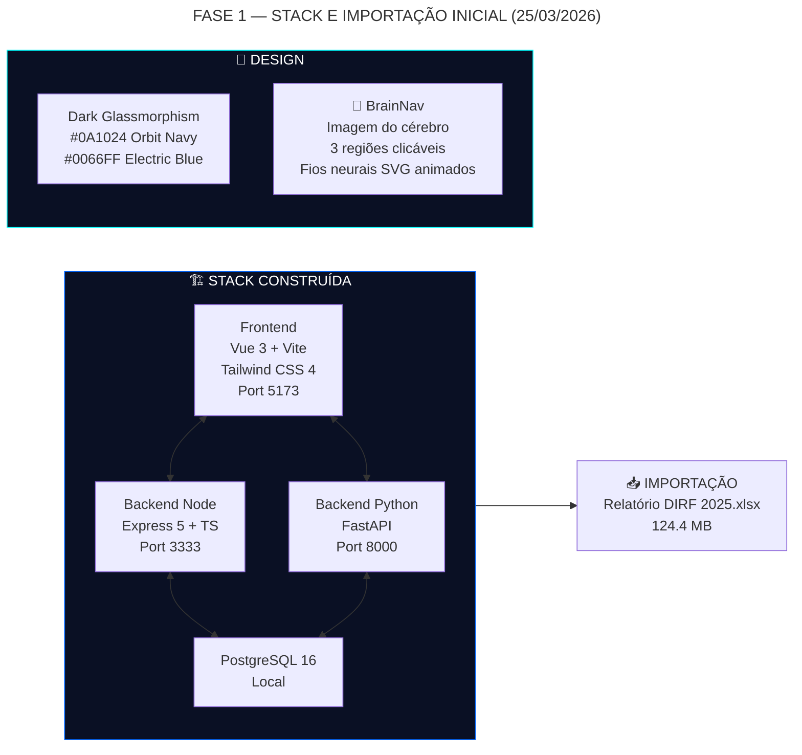
```mermaid
---
title: "FASE 1 — STACK E IMPORTAÇÃO INICIAL (25/03/2026)"
---
flowchart LR
    subgraph STACK["🏗️ STACK CONSTRUÍDA"]
        FE["Frontend\nVue 3 + Vite\nTailwind CSS 4\nPort 5173"]
        BE_NODE["Backend Node\nExpress 5 + TS\nPort 3333"]
        BE_PY["Backend Python\nFastAPI\nPort 8000"]
        DB["PostgreSQL 16\nLocal"]
        FE <--> BE_NODE
        FE <--> BE_PY
        BE_NODE <--> DB
        BE_PY <--> DB
    end

    subgraph DESIGN["🎨 DESIGN"]
        DARK["Dark Glassmorphism\n#0A1024 Orbit Navy\n#0066FF Electric Blue"]
        BRAIN["🧠 BrainNav\nImagem do cérebro\n3 regiões clicáveis\nFios neurais SVG animados"]
    end

    STACK --> IMPORT["📥 IMPORTAÇÃO\nRelatório DIRF 2025.xlsx\n124.4 MB"]

    style STACK fill:#0a1024,stroke:#0066ff,color:#fff
    style DESIGN fill:#0a1024,stroke:#00ffff,color:#fff
```

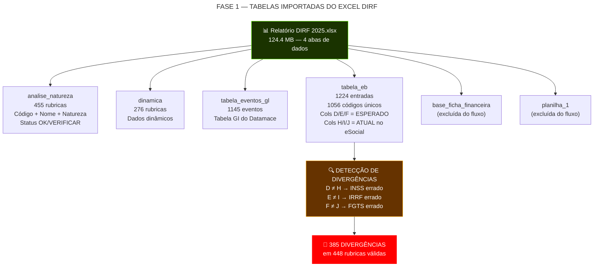
```mermaid
---
title: "FASE 1 — TABELAS IMPORTADAS DO EXCEL DIRF"
---
flowchart TB
    EXCEL["📊 Relatório DIRF 2025.xlsx\n124.4 MB — 4 abas de dados"]

    EXCEL --> AN["analise_natureza\n455 rubricas\nCódigo + Nome + Natureza\nStatus OK/VERIFICAR"]
    EXCEL --> DIN["dinamica\n276 rubricas\nDados dinâmicos"]
    EXCEL --> TEG["tabela_eventos_gl\n1145 eventos\nTabela GI do Datamace"]
    EXCEL --> TEB["tabela_eb\n1224 entradas\n1056 códigos únicos\nCols D/E/F = ESPERADO\nCols H/I/J = ATUAL no eSocial"]
    EXCEL --> BFF["base_ficha_financeira\n(excluída do fluxo)"]
    EXCEL --> PL1["planilha_1\n(excluída do fluxo)"]

    TEB --> DIV["🔍 DETECÇÃO DE DIVERGÊNCIAS\nD ≠ H → INSS errado\nE ≠ I → IRRF errado\nF ≠ J → FGTS errado"]
    DIV --> RESULT["🔴 385 DIVERGÊNCIAS\nem 448 rubricas válidas"]

    style EXCEL fill:#1a3300,stroke:#66ff00,color:#fff
    style RESULT fill:#ff0000,stroke:#fff,color:#fff
    style DIV fill:#663300,stroke:#ffaa00,color:#fff
```

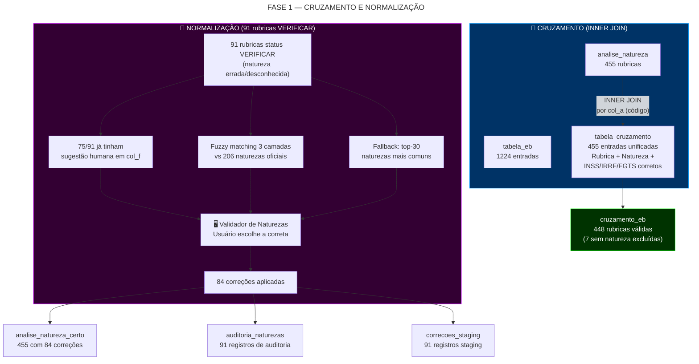
```mermaid
---
title: "FASE 1 — CRUZAMENTO E NORMALIZAÇÃO"
---
flowchart TB
    subgraph CRUZ["🔗 CRUZAMENTO (INNER JOIN)"]
        AN2["analise_natureza\n455 rubricas"]
        TEB2["tabela_eb\n1224 entradas"]
        AN2 -->|"INNER JOIN\npor col_a (código)"| TC["tabela_cruzamento\n455 entradas unificadas\nRubrica + Natureza +\nINSS/IRRF/FGTS corretos"]
    end

    subgraph NORM["📐 NORMALIZAÇÃO (91 rubricas VERIFICAR)"]
        V91["91 rubricas status VERIFICAR\n(natureza errada/desconhecida)"]
        V91 --> SUG["75/91 já tinham\nsugestão humana em col_f"]
        V91 --> FUZZY["Fuzzy matching 3 camadas\nvs 206 naturezas oficiais"]
        V91 --> TOP30["Fallback: top-30\nnaturezas mais comuns"]
        SUG --> VALID["🖥️ Validador de Naturezas\nUsuário escolhe a correta"]
        FUZZY --> VALID
        TOP30 --> VALID
        VALID --> CORR["84 correções aplicadas"]
    end

    TC --> CEB["cruzamento_eb\n448 rubricas válidas\n(7 sem natureza excluídas)"]
    CORR --> ANC["analise_natureza_certo\n455 com 84 correções"]
    CORR --> AUD["auditoria_naturezas\n91 registros de auditoria"]
    CORR --> STAG["correcoes_staging\n91 registros staging"]

    style CRUZ fill:#003366,stroke:#0099ff,color:#fff
    style NORM fill:#330033,stroke:#cc00ff,color:#fff
    style CEB fill:#003300,stroke:#00ff00,color:#fff
```

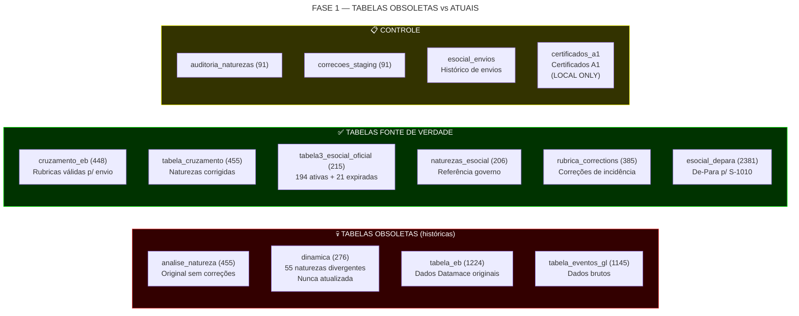
```mermaid
---
title: "FASE 1 — TABELAS OBSOLETAS vs ATUAIS"
---
flowchart LR
    subgraph OBSOLETAS["💀 TABELAS OBSOLETAS (históricas)"]
        direction TB
        OB1["analise_natureza (455)\nOriginal sem correções"]
        OB2["dinamica (276)\n55 naturezas divergentes\nNunca atualizada"]
        OB3["tabela_eb (1224)\nDados Datamace originais"]
        OB4["tabela_eventos_gl (1145)\nDados brutos"]
    end

    subgraph ATUAIS["✅ TABELAS FONTE DE VERDADE"]
        direction TB
        AT1["cruzamento_eb (448)\nRubricas válidas p/ envio"]
        AT2["tabela_cruzamento (455)\nNaturezas corrigidas"]
        AT3["tabela3_esocial_oficial (215)\n194 ativas + 21 expiradas"]
        AT4["naturezas_esocial (206)\nReferência governo"]
        AT5["rubrica_corrections (385)\nCorreções de incidência"]
        AT6["esocial_depara (2381)\nDe-Para p/ S-1010"]
    end

    subgraph CONTROLE["📋 CONTROLE"]
        direction TB
        CT1["auditoria_naturezas (91)"]
        CT2["correcoes_staging (91)"]
        CT3["esocial_envios\nHistórico de envios"]
        CT4["certificados_a1\nCertificados A1\n(LOCAL ONLY)"]
    end

    style OBSOLETAS fill:#330000,stroke:#ff4444,color:#fff
    style ATUAIS fill:#003300,stroke:#00ff00,color:#fff
    style CONTROLE fill:#333300,stroke:#ffff00,color:#fff
```

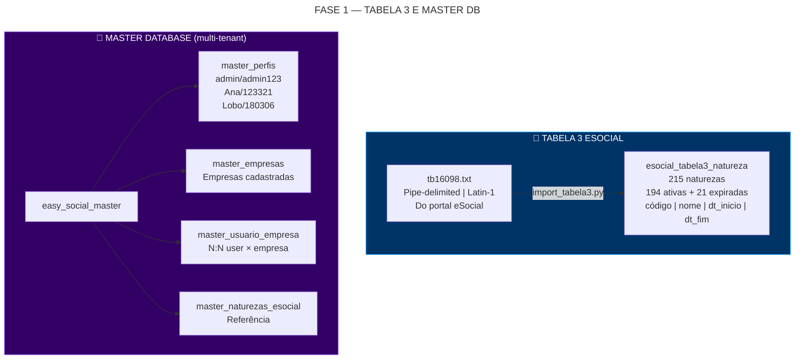
```mermaid
---
title: "FASE 1 — TABELA 3 E MASTER DB"
---
flowchart TB
    subgraph TAB3["📜 TABELA 3 ESOCIAL"]
        TXT["tb16098.txt\nPipe-delimited | Latin-1\nDo portal eSocial"]
        TXT -->|"import_tabela3.py"| T3["esocial_tabela3_natureza\n215 naturezas\n194 ativas + 21 expiradas\ncódigo | nome | dt_inicio | dt_fim"]
    end

    subgraph MASTER["🏢 MASTER DATABASE (multi-tenant)"]
        MDB["easy_social_master"]
        MDB --> USR["master_perfis\nadmin/admin123\nAna/123321\nLobo/180306"]
        MDB --> EMP["master_empresas\nEmpresas cadastradas"]
        MDB --> UE["master_usuario_empresa\nN:N user × empresa"]
        MDB --> MNAT["master_naturezas_esocial\nReferência"]
    end

    style TAB3 fill:#003366,stroke:#0099ff,color:#fff
    style MASTER fill:#330066,stroke:#9966ff,color:#fff
```

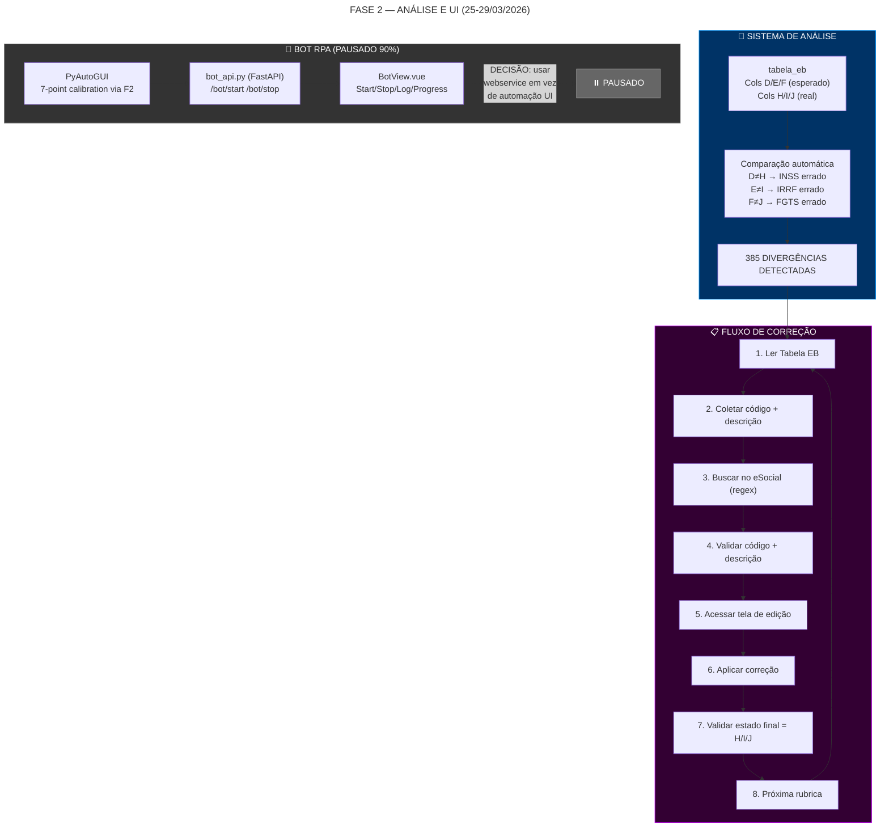
```mermaid
---
title: "FASE 2 — ANÁLISE E UI (25-29/03/2026)"
---
flowchart TB
    subgraph ANALISE["🔬 SISTEMA DE ANÁLISE"]
        TEB3["tabela_eb\nCols D/E/F (esperado)\nCols H/I/J (real)"]
        TEB3 --> COMP["Comparação automática\nD≠H → INSS errado\nE≠I → IRRF errado\nF≠J → FGTS errado"]
        COMP --> D385["385 DIVERGÊNCIAS DETECTADAS"]
    end

    subgraph FLUXO_CORR["📋 FLUXO DE CORREÇÃO"]
        D385 --> LER["1. Ler Tabela EB"]
        LER --> COLETAR["2. Coletar código + descrição"]
        COLETAR --> BUSCAR["3. Buscar no eSocial (regex)"]
        BUSCAR --> VALIDAR["4. Validar código + descrição"]
        VALIDAR --> TELA["5. Acessar tela de edição"]
        TELA --> APLICAR["6. Aplicar correção"]
        APLICAR --> CONFIRMAR["7. Validar estado final = H/I/J"]
        CONFIRMAR --> PROX["8. Próxima rubrica"]
        PROX --> LER
    end

    subgraph BOT["🤖 BOT RPA (PAUSADO 90%)"]
        PYAUTO["PyAutoGUI\n7-point calibration via F2"]
        PYAUTO --> BOTAPI["bot_api.py (FastAPI)\n/bot/start /bot/stop"]
        BOTAPI --> BOTVIEW["BotView.vue\nStart/Stop/Log/Progress"]
        BOTVIEW -.->|"DECISÃO: usar\nwebservice em vez\nde automação UI"| PAUSED["⏸️ PAUSADO"]
    end

    style ANALISE fill:#003366,stroke:#0099ff,color:#fff
    style FLUXO_CORR fill:#330033,stroke:#cc00ff,color:#fff
    style BOT fill:#333333,stroke:#888,color:#fff
    style PAUSED fill:#666,stroke:#999,color:#fff
```

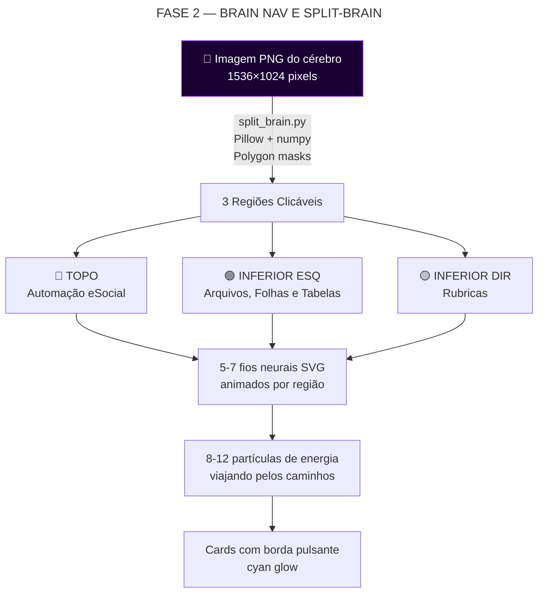
```mermaid
---
title: "FASE 2 — BRAIN NAV E SPLIT-BRAIN"
---
flowchart TB
    BRAIN_IMG["🧠 Imagem PNG do cérebro\n1536×1024 pixels"]
    BRAIN_IMG -->|"split_brain.py\nPillow + numpy\nPolygon masks"| REGIOES["3 Regiões Clicáveis"]

    REGIOES --> R1["🔴 TOPO\nAutomação eSocial"]
    REGIOES --> R2["🟢 INFERIOR ESQ\nArquivos, Folhas e Tabelas"]
    REGIOES --> R3["🟡 INFERIOR DIR\nRubricas"]

    R1 --> WIRES["5-7 fios neurais SVG\nanimados por região"]
    R2 --> WIRES
    R3 --> WIRES

    WIRES --> PARTICLES["8-12 partículas de energia\nviajando pelos caminhos"]
    PARTICLES --> CARDS["Cards com borda pulsante\ncyan glow"]

    style BRAIN_IMG fill:#1a0033,stroke:#9933ff,color:#fff
```

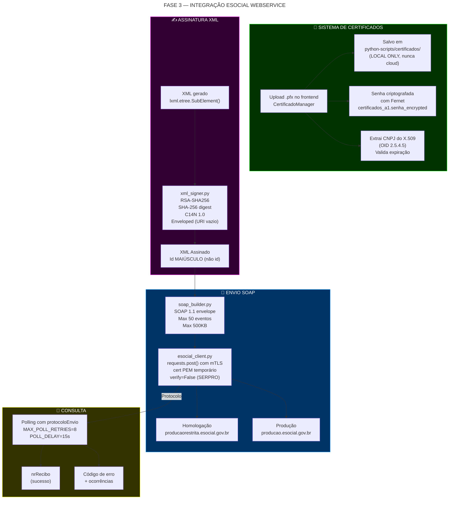
```mermaid
---
title: "FASE 3 — INTEGRAÇÃO ESOCIAL WEBSERVICE"
---
flowchart TB
    subgraph CERT["🔐 SISTEMA DE CERTIFICADOS"]
        UPLOAD_CERT["Upload .pfx no frontend\nCertificadoManager"]
        UPLOAD_CERT --> STORE["Salvo em\npython-scripts/certificados/\n(LOCAL ONLY, nunca cloud)"]
        UPLOAD_CERT --> ENCRYPT["Senha criptografada\ncom Fernet\ncertificados_a1.senha_encrypted"]
        UPLOAD_CERT --> EXTRACT["Extrai CNPJ do X.509\n(OID 2.5.4.5)\nValida expiração"]
    end

    subgraph SIGN["✍️ ASSINATURA XML"]
        XML_RAW["XML gerado\nlxml.etree.SubElement()"]
        XML_RAW --> SIGNER["xml_signer.py\nRSA-SHA256\nSHA-256 digest\nC14N 1.0\nEnveloped (URI vazio)"]
        SIGNER --> SIGNED["XML Assinado\nId MAIÚSCULO (não id)"]
    end

    subgraph SOAP["📨 ENVIO SOAP"]
        SIGNED --> ENVELOPE["soap_builder.py\nSOAP 1.1 envelope\nMax 50 eventos\nMax 500KB"]
        ENVELOPE --> MTLS["esocial_client.py\nrequests.post() com mTLS\ncert PEM temporário\nverify=False (SERPRO)"]
        MTLS --> HOM["Homologação\nproducaorestrita.esocial.gov.br"]
        MTLS --> PROD["Produção\nproducao.esocial.gov.br"]
    end

    subgraph POLL["🔄 CONSULTA"]
        MTLS -->|"Protocolo"| POLLING["Polling com protocoloEnvio\nMAX_POLL_RETRIES=8\nPOLL_DELAY=15s"]
        POLLING --> RECIBO["nrRecibo\n(sucesso)"]
        POLLING --> ERRO["Código de erro\n+ ocorrências"]
    end

    style CERT fill:#003300,stroke:#00ff00,color:#fff
    style SIGN fill:#330033,stroke:#ff00ff,color:#fff
    style SOAP fill:#003366,stroke:#0099ff,color:#fff
    style POLL fill:#333300,stroke:#ffff00,color:#fff
```

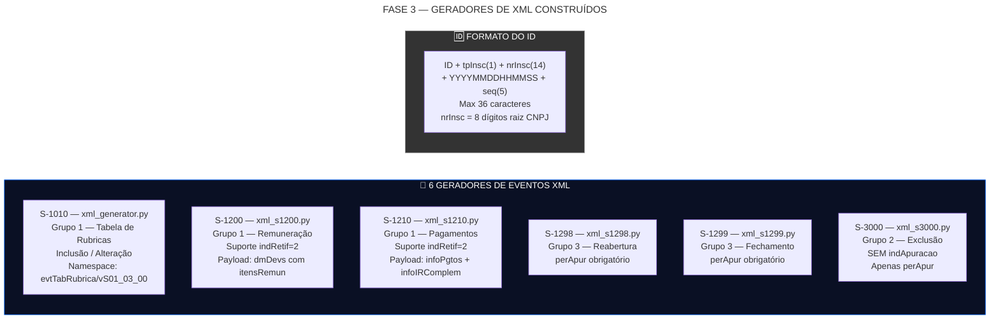
```mermaid
---
title: "FASE 3 — GERADORES DE XML CONSTRUÍDOS"
---
flowchart LR
    subgraph GERADORES["📝 6 GERADORES DE EVENTOS XML"]
        direction TB
        S1010["S-1010 — xml_generator.py\nGrupo 1 — Tabela de Rubricas\nInclusão / Alteração\nNamespace: evtTabRubrica/vS01_03_00"]
        S1200["S-1200 — xml_s1200.py\nGrupo 1 — Remuneração\nSuporte indRetif=2\nPayload: dmDevs com itensRemun"]
        S1210["S-1210 — xml_s1210.py\nGrupo 1 — Pagamentos\nSuporte indRetif=2\nPayload: infoPgtos + infoIRComplem"]
        S1298["S-1298 — xml_s1298.py\nGrupo 3 — Reabertura\nperApur obrigatório"]
        S1299["S-1299 — xml_s1299.py\nGrupo 3 — Fechamento\nperApur obrigatório"]
        S3000["S-3000 — xml_s3000.py\nGrupo 2 — Exclusão\nSEM indApuracao\nApenas perApur"]
    end

    subgraph ID_FMT["🆔 FORMATO DO ID"]
        IDFMT["ID + tpInsc(1) + nrInsc(14)\n+ YYYYMMDDHHMMSS + seq(5)\nMax 36 caracteres\nnrInsc = 8 dígitos raiz CNPJ"]
    end

    style GERADORES fill:#0a1024,stroke:#0066ff,color:#fff
    style ID_FMT fill:#333,stroke:#999,color:#fff
```

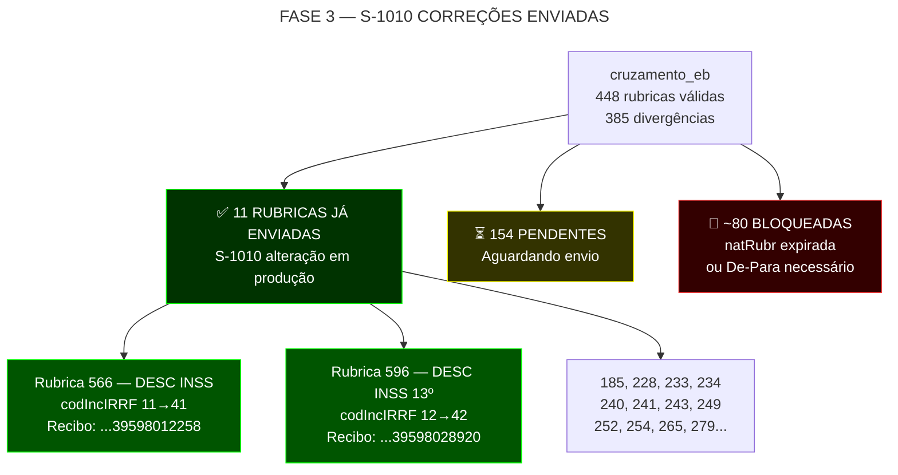
```mermaid
---
title: "FASE 3 — S-1010 CORREÇÕES ENVIADAS"
---
flowchart TB
    CEB2["cruzamento_eb\n448 rubricas válidas\n385 divergências"]

    CEB2 --> ENVIADAS["✅ 11 RUBRICAS JÁ ENVIADAS\nS-1010 alteração em produção"]
    CEB2 --> PENDENTES["⏳ 154 PENDENTES\nAguardando envio"]
    CEB2 --> BLOQUEADAS["🚫 ~80 BLOQUEADAS\nnatRubr expirada\nou De-Para necessário"]

    ENVIADAS --> R566["Rubrica 566 — DESC INSS\ncodIncIRRF 11→41\nRecibo: ...39598012258"]
    ENVIADAS --> R596["Rubrica 596 — DESC INSS 13º\ncodIncIRRF 12→42\nRecibo: ...39598028920"]
    ENVIADAS --> ROUT["185, 228, 233, 234\n240, 241, 243, 249\n252, 254, 265, 279..."]

    style ENVIADAS fill:#003300,stroke:#00ff00,color:#fff
    style PENDENTES fill:#333300,stroke:#ffff00,color:#fff
    style BLOQUEADAS fill:#330000,stroke:#ff4444,color:#fff
    style R566 fill:#005500,stroke:#00ff00,color:#fff
    style R596 fill:#005500,stroke:#00ff00,color:#fff
```

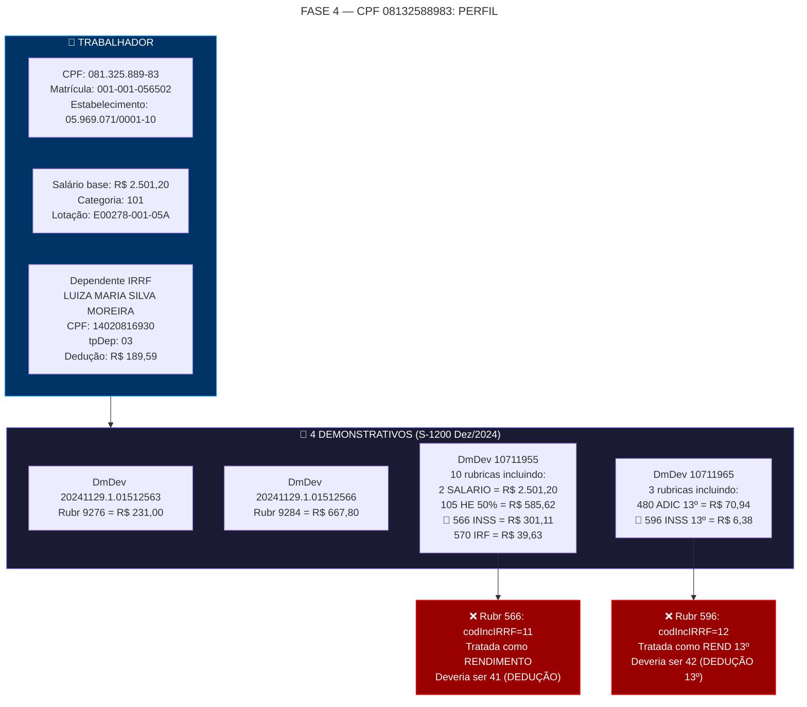
```mermaid
---
title: "FASE 4 — CPF 08132588983: PERFIL"
---
flowchart TB
    subgraph PERFIL["👤 TRABALHADOR"]
        CPF_ID["CPF: 081.325.889-83\nMatrícula: 001-001-056502\nEstabelecimento: 05.969.071/0001-10"]
        SAL["Salário base: R$ 2.501,20\nCategoria: 101\nLotação: E00278-001-05A"]
        DEP["Dependente IRRF\nLUIZA MARIA SILVA MOREIRA\nCPF: 14020816930\ntpDep: 03\nDedução: R$ 189,59"]
    end

    subgraph DMDEVS["📄 4 DEMONSTRATIVOS (S-1200 Dez/2024)"]
        DM1["DmDev 20241129.1.01512563\nRubr 9276 = R$ 231,00"]
        DM2["DmDev 20241129.1.01512566\nRubr 9284 = R$ 667,80"]
        DM3["DmDev 10711955\n10 rubricas incluindo:\n2 SALARIO = R$ 2.501,20\n105 HE 50% = R$ 585,62\n🔴 566 INSS = R$ 301,11\n570 IRF = R$ 39,63"]
        DM4["DmDev 10711965\n3 rubricas incluindo:\n480 ADIC 13º = R$ 70,94\n🔴 596 INSS 13º = R$ 6,38"]
    end

    PERFIL --> DMDEVS
    DM3 --> BUG566["❌ Rubr 566: codIncIRRF=11\nTratada como RENDIMENTO\nDeveria ser 41 (DEDUÇÃO)"]
    DM4 --> BUG596["❌ Rubr 596: codIncIRRF=12\nTratada como REND 13º\nDeveria ser 42 (DEDUÇÃO 13º)"]

    style PERFIL fill:#003366,stroke:#0099ff,color:#fff
    style DMDEVS fill:#1a1a33,stroke:#6666ff,color:#fff
    style BUG566 fill:#990000,stroke:#ff0000,color:#fff
    style BUG596 fill:#990000,stroke:#ff0000,color:#fff
```

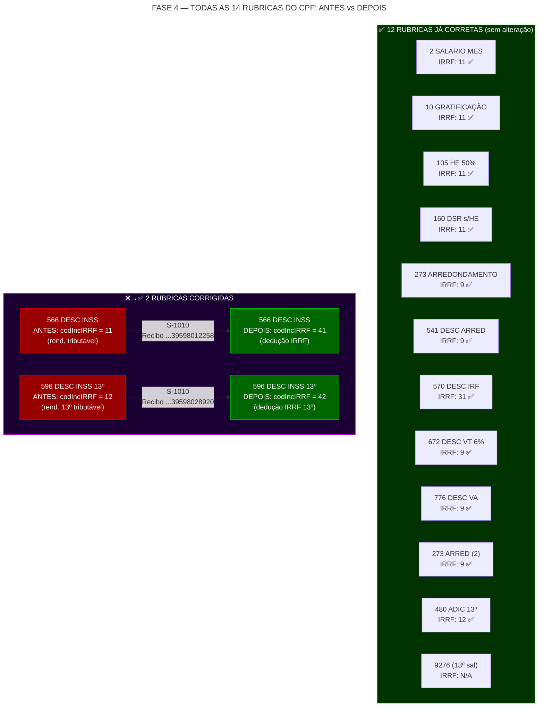
```mermaid
---
title: "FASE 4 — TODAS AS 14 RUBRICAS DO CPF: ANTES vs DEPOIS"
---
flowchart TB
    subgraph OK["✅ 12 RUBRICAS JÁ CORRETAS (sem alteração)"]
        R2["2 SALARIO MES\nIRRF: 11 ✅"]
        R10["10 GRATIFICAÇÃO\nIRRF: 11 ✅"]
        R105["105 HE 50%\nIRRF: 11 ✅"]
        R160["160 DSR s/HE\nIRRF: 11 ✅"]
        R273a["273 ARREDONDAMENTO\nIRRF: 9 ✅"]
        R541["541 DESC ARRED\nIRRF: 9 ✅"]
        R570["570 DESC IRF\nIRRF: 31 ✅"]
        R672["672 DESC VT 6%\nIRRF: 9 ✅"]
        R776["776 DESC VA\nIRRF: 9 ✅"]
        R273b["273 ARRED (2)\nIRRF: 9 ✅"]
        R480["480 ADIC 13º\nIRRF: 12 ✅"]
        R9276["9276 (13º sal)\nIRRF: N/A"]
    end

    subgraph ERRADAS["❌→✅ 2 RUBRICAS CORRIGIDAS"]
        R566_A["566 DESC INSS\nANTES: codIncIRRF = 11\n(rend. tributável)"]
        R566_D["566 DESC INSS\nDEPOIS: codIncIRRF = 41\n(dedução IRRF)"]
        R596_A["596 DESC INSS 13º\nANTES: codIncIRRF = 12\n(rend. 13º tributável)"]
        R596_D["596 DESC INSS 13º\nDEPOIS: codIncIRRF = 42\n(dedução IRRF 13º)"]

        R566_A -->|"S-1010\nRecibo ...39598012258"| R566_D
        R596_A -->|"S-1010\nRecibo ...39598028920"| R596_D
    end

    style OK fill:#003300,stroke:#00ff00,color:#fff
    style ERRADAS fill:#1a0033,stroke:#ff00ff,color:#fff
    style R566_A fill:#990000,stroke:#ff0000,color:#fff
    style R596_A fill:#990000,stroke:#ff0000,color:#fff
    style R566_D fill:#006600,stroke:#00ff00,color:#fff
    style R596_D fill:#006600,stroke:#00ff00,color:#fff
```

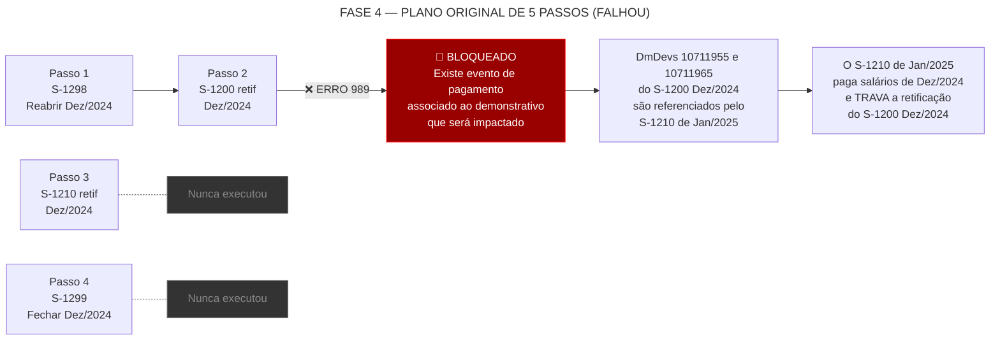
```mermaid
---
title: "FASE 4 — PLANO ORIGINAL DE 5 PASSOS (FALHOU)"
---
flowchart LR
    P1["Passo 1\nS-1298\nReabrir Dez/2024"]
    P2["Passo 2\nS-1200 retif\nDez/2024"]
    P3["Passo 3\nS-1210 retif\nDez/2024"]
    P4["Passo 4\nS-1299\nFechar Dez/2024"]

    P1 --> P2
    P2 -->|"❌ ERRO 989"| BLOCK["🚫 BLOQUEADO\nExiste evento de pagamento\nassociado ao demonstrativo\nque será impactado"]

    BLOCK --> CAUSA2["DmDevs 10711955 e 10711965\ndo S-1200 Dez/2024\nsão referenciados pelo\nS-1210 de Jan/2025"]

    CAUSA2 --> PROBLEMA2["O S-1210 de Jan/2025\npaga salários de Dez/2024\ne TRAVA a retificação\ndo S-1200 Dez/2024"]

    P3 -.- NEVER1["Nunca executou"]
    P4 -.- NEVER2["Nunca executou"]

    style BLOCK fill:#990000,stroke:#ff0000,color:#fff
    style NEVER1 fill:#333,stroke:#666,color:#888
    style NEVER2 fill:#333,stroke:#666,color:#888
```

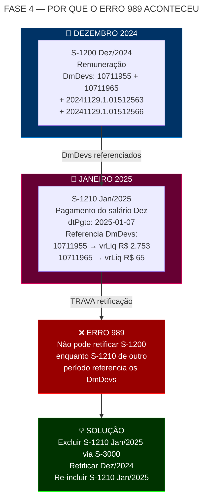
```mermaid
---
title: "FASE 4 — POR QUE O ERRO 989 ACONTECEU"
---
flowchart TB
    subgraph DEZ["📅 DEZEMBRO 2024"]
        S1200_DEZ["S-1200 Dez/2024\nRemuneração\nDmDevs: 10711955 + 10711965\n+ 20241129.1.01512563\n+ 20241129.1.01512566"]
    end

    subgraph JAN["📅 JANEIRO 2025"]
        S1210_JAN["S-1210 Jan/2025\nPagamento do salário Dez\ndtPgto: 2025-01-07\nReferencia DmDevs:\n10711955 → vrLiq R$ 2.753\n10711965 → vrLiq R$ 65"]
    end

    S1200_DEZ -->|"DmDevs referenciados"| S1210_JAN
    S1210_JAN -->|"TRAVA retificação"| ERRO989["❌ ERRO 989\nNão pode retificar S-1200\nenquanto S-1210 de outro\nperíodo referencia os DmDevs"]

    ERRO989 --> SOLUCAO["💡 SOLUÇÃO\nExcluir S-1210 Jan/2025 via S-3000\nRetificar Dez/2024\nRe-incluir S-1210 Jan/2025"]

    style DEZ fill:#003366,stroke:#0099ff,color:#fff
    style JAN fill:#660033,stroke:#ff0066,color:#fff
    style ERRO989 fill:#990000,stroke:#ff0000,color:#fff
    style SOLUCAO fill:#003300,stroke:#00ff00,color:#fff
```

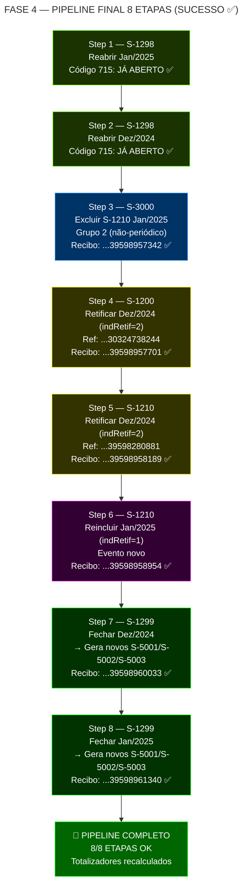
```mermaid
---
title: "FASE 4 — PIPELINE FINAL 8 ETAPAS (SUCESSO ✅)"
---
flowchart TB
    STEP1["Step 1 — S-1298\nReabrir Jan/2025\nCódigo 715: JÁ ABERTO ✅"]
    STEP2["Step 2 — S-1298\nReabrir Dez/2024\nCódigo 715: JÁ ABERTO ✅"]
    STEP3["Step 3 — S-3000\nExcluir S-1210 Jan/2025\nGrupo 2 (não-periódico)\nRecibo: ...39598957342 ✅"]
    STEP4["Step 4 — S-1200\nRetificar Dez/2024 (indRetif=2)\nRef: ...30324738244\nRecibo: ...39598957701 ✅"]
    STEP5["Step 5 — S-1210\nRetificar Dez/2024 (indRetif=2)\nRef: ...39598280881\nRecibo: ...39598958189 ✅"]
    STEP6["Step 6 — S-1210\nReincluir Jan/2025 (indRetif=1)\nEvento novo\nRecibo: ...39598958954 ✅"]
    STEP7["Step 7 — S-1299\nFechar Dez/2024\n→ Gera novos S-5001/S-5002/S-5003\nRecibo: ...39598960033 ✅"]
    STEP8["Step 8 — S-1299\nFechar Jan/2025\n→ Gera novos S-5001/S-5002/S-5003\nRecibo: ...39598961340 ✅"]

    STEP1 --> STEP2
    STEP2 --> STEP3
    STEP3 --> STEP4
    STEP4 --> STEP5
    STEP5 --> STEP6
    STEP6 --> STEP7
    STEP7 --> STEP8
    STEP8 --> FIM["🏁 PIPELINE COMPLETO\n8/8 ETAPAS OK\nTotalizadores recalculados"]

    style STEP1 fill:#1a3300,stroke:#66ff00,color:#fff
    style STEP2 fill:#1a3300,stroke:#66ff00,color:#fff
    style STEP3 fill:#003366,stroke:#3399ff,color:#fff
    style STEP4 fill:#333300,stroke:#ffff00,color:#fff
    style STEP5 fill:#333300,stroke:#ffff00,color:#fff
    style STEP6 fill:#330033,stroke:#ff66ff,color:#fff
    style STEP7 fill:#003300,stroke:#00ff00,color:#fff
    style STEP8 fill:#003300,stroke:#00ff00,color:#fff
    style FIM fill:#006600,stroke:#00ff00,color:#fff
```

```mermaid
---
title: "FASE 4 — 4 ERROS ENCONTRADOS E CORRIGIDOS DURANTE EXECUÇÃO"
---
flowchart TB
    subgraph E1["❌ ERRO 1: Erro 989 — Plano Original"]
        E1P["S-1200 Dez/2024 bloqueado\npor S-1210 Jan/2025\nreferenciando DmDevs"]
        E1S["✅ FIX: Redesenhar 5→8 etapas\nS-3000 excluir S-1210 Jan\nRetificar Dez\nRe-incluir S-1210 Jan"]
        E1P --> E1S
    end

    subgraph E2["❌ ERRO 2: Erro 101 — S-3000 Grupo Errado"]
        E2P["S-3000 enviado no grupo 3\n(periódicos)\neSocial rejeitou"]
        E2S["✅ FIX: Mudar grupo para 2\n(não-periódicos)\nem sync e streaming"]
        E2P --> E2S
    end

    subgraph E3["❌ ERRO 3: indApuracao Rejeitado"]
        E3P["S-3000 com campo indApuracao\ndentro de ideFolhaPagto\neSocial não aceita"]
        E3S["✅ FIX: Remover indApuracao\ndo xml_s3000.py\nManter apenas perApur"]
        E3P --> E3S
    end

    subgraph E4["❌ ERRO 4: Conexão Instável"]
        E4P["Webservice SERPRO\ndroppando conexões\nRemote end closed\nconnection without response"]
        E4S["✅ FIX: Retry robusto\nMAX_SEND: 3→5\nMAX_POLL: 5→8\nPOLL_DELAY: 12→15s\nSEND_DELAY: 8→10s\nPolling: break→continue"]
        E4P --> E4S
    end

    style E1 fill:#1a0000,stroke:#ff4444,color:#fff
    style E2 fill:#1a0000,stroke:#ff4444,color:#fff
    style E3 fill:#1a0000,stroke:#ff4444,color:#fff
    style E4 fill:#1a0000,stroke:#ff4444,color:#fff
    style E1S fill:#003300,stroke:#00ff00,color:#fff
    style E2S fill:#003300,stroke:#00ff00,color:#fff
    style E3S fill:#003300,stroke:#00ff00,color:#fff
    style E4S fill:#003300,stroke:#00ff00,color:#fff
```

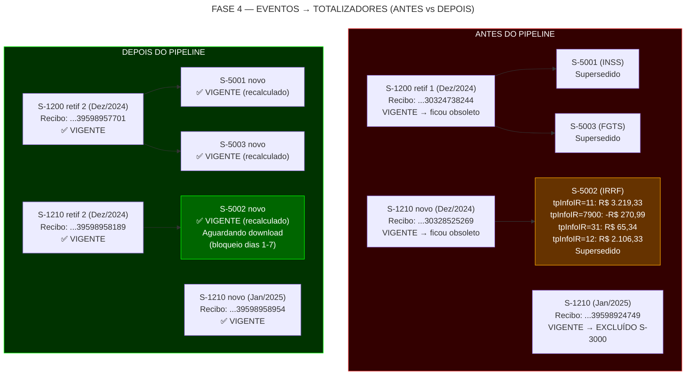
```mermaid
---
title: "FASE 4 — EVENTOS → TOTALIZADORES (ANTES vs DEPOIS)"
---
flowchart TB
    subgraph ANTES2["ANTES DO PIPELINE"]
        S1200_V1["S-1200 retif 1 (Dez/2024)\nRecibo: ...30324738244\nVIGENTE → ficou obsoleto"]
        S1210_V1["S-1210 novo (Dez/2024)\nRecibo: ...30328525269\nVIGENTE → ficou obsoleto"]
        S1210_JAN_V1["S-1210 (Jan/2025)\nRecibo: ...39598924749\nVIGENTE → EXCLUÍDO S-3000"]

        S1200_V1 --> S5001_V1["S-5001 (INSS)\nSupersedido"]
        S1200_V1 --> S5003_V1["S-5003 (FGTS)\nSupersedido"]
        S1210_V1 --> S5002_V1["S-5002 (IRRF)\ntpInfoIR=11: R$ 3.219,33\ntpInfoIR=7900: -R$ 270,99\ntpInfoIR=31: R$ 65,34\ntpInfoIR=12: R$ 2.106,33\nSupersedido"]
    end

    subgraph DEPOIS["DEPOIS DO PIPELINE"]
        S1200_V2["S-1200 retif 2 (Dez/2024)\nRecibo: ...39598957701\n✅ VIGENTE"]
        S1210_V2["S-1210 retif 2 (Dez/2024)\nRecibo: ...39598958189\n✅ VIGENTE"]
        S1210_JAN_V2["S-1210 novo (Jan/2025)\nRecibo: ...39598958954\n✅ VIGENTE"]

        S1200_V2 --> S5001_V2["S-5001 novo\n✅ VIGENTE (recalculado)"]
        S1200_V2 --> S5003_V2["S-5003 novo\n✅ VIGENTE (recalculado)"]
        S1210_V2 --> S5002_V2["S-5002 novo\n✅ VIGENTE (recalculado)\nAguardando download\n(bloqueio dias 1-7)"]
    end

    style ANTES2 fill:#330000,stroke:#ff4444,color:#fff
    style DEPOIS fill:#003300,stroke:#00ff00,color:#fff
    style S5002_V1 fill:#663300,stroke:#ffaa00,color:#fff
    style S5002_V2 fill:#006600,stroke:#00ff00,color:#fff
```

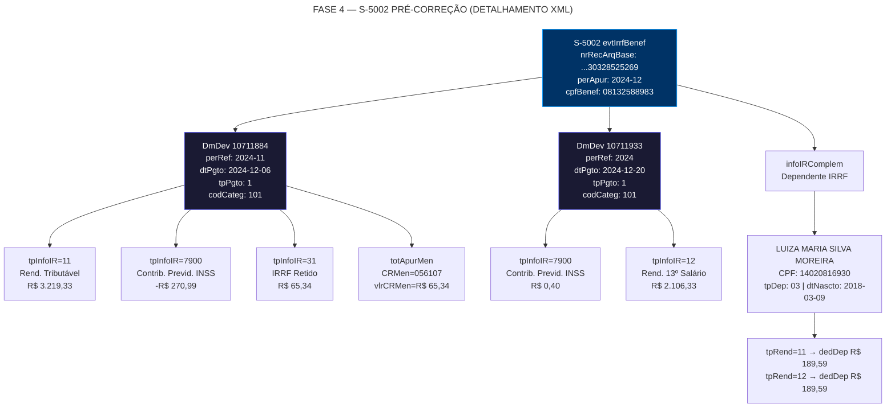
```mermaid
---
title: "FASE 4 — S-5002 PRÉ-CORREÇÃO (DETALHAMENTO XML)"
---
flowchart TB
    S5002["S-5002 evtIrrfBenef\nnrRecArqBase: ...30328525269\nperApur: 2024-12\ncpfBenef: 08132588983"]

    S5002 --> DM_A["DmDev 10711884\nperRef: 2024-11\ndtPgto: 2024-12-06\ntpPgto: 1\ncodCateg: 101"]
    S5002 --> DM_B["DmDev 10711933\nperRef: 2024\ndtPgto: 2024-12-20\ntpPgto: 1\ncodCateg: 101"]

    DM_A --> IR_A1["tpInfoIR=11\nRend. Tributável\nR$ 3.219,33"]
    DM_A --> IR_A2["tpInfoIR=7900\nContrib. Previd. INSS\n-R$ 270,99"]
    DM_A --> IR_A3["tpInfoIR=31\nIRRF Retido\nR$ 65,34"]
    DM_A --> TOT_A["totApurMen\nCRMen=056107\nvlrCRMen=R$ 65,34"]

    DM_B --> IR_B1["tpInfoIR=7900\nContrib. Previd. INSS\nR$ 0,40"]
    DM_B --> IR_B2["tpInfoIR=12\nRend. 13º Salário\nR$ 2.106,33"]

    S5002 --> DEP_IR["infoIRComplem\nDependente IRRF"]
    DEP_IR --> DEP1["LUIZA MARIA SILVA MOREIRA\nCPF: 14020816930\ntpDep: 03 | dtNascto: 2018-03-09"]
    DEP1 --> DED1["tpRend=11 → dedDep R$ 189,59\ntpRend=12 → dedDep R$ 189,59"]

    style S5002 fill:#003366,stroke:#0099ff,color:#fff
    style DM_A fill:#1a1a33,stroke:#6666ff,color:#fff
    style DM_B fill:#1a1a33,stroke:#6666ff,color:#fff
```

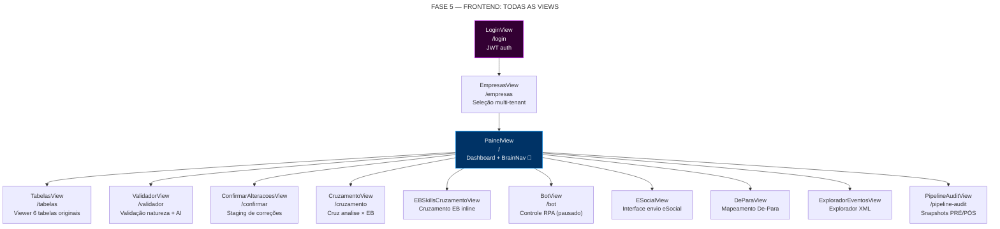
```mermaid
---
title: "FASE 5 — FRONTEND: TODAS AS VIEWS"
---
flowchart TB
    LOGIN["LoginView\n/login\nJWT auth"]
    LOGIN --> EMPRESAS["EmpresasView\n/empresas\nSeleção multi-tenant"]
    EMPRESAS --> PAINEL["PainelView\n/\nDashboard + BrainNav 🧠"]

    PAINEL --> TABELAS["TabelasView\n/tabelas\nViewer 6 tabelas originais"]
    PAINEL --> VALID["ValidadorView\n/validador\nValidação natureza + AI"]
    PAINEL --> CONFIRM["ConfirmarAlteracoesView\n/confirmar\nStaging de correções"]
    PAINEL --> CRUZ2["CruzamentoView\n/cruzamento\nCruz analise × EB"]
    PAINEL --> EBSC["EBSkillsCruzamentoView\nCruzamento EB inline"]
    PAINEL --> BOT2["BotView\n/bot\nControle RPA (pausado)"]
    PAINEL --> ESOC["ESocialView\nInterface envio eSocial"]
    PAINEL --> DEPA["DeParaView\nMapeamento De-Para"]
    PAINEL --> EXPL["ExploradorEventosView\nExplorador XML"]
    PAINEL --> PIPE["PipelineAuditView\n/pipeline-audit\nSnapshots PRÉ/PÓS"]

    style LOGIN fill:#330033,stroke:#cc00ff,color:#fff
    style PAINEL fill:#003366,stroke:#0099ff,color:#fff
```

```mermaid
---
title: "FASE 5 — BACKEND: ENDPOINTS API"
---
flowchart TB
    subgraph NODE["🟢 NODE.JS EXPRESS 5 — PORT 3333"]
        AUTH["/auth/login /auth/me\n/auth/empresas\nJWT + CRUD users"]
        UPL["/upload\nDIRF.xlsx\nMulter 200MB max"]
        TBL["/tables\nCRUD 6 tabelas\nPaginação + XLSX export"]
        CRZ["/cruzamento\nUpload + Inner Join"]
        NAT["/naturezas\nBusca + Sugestões + Correções"]
        VALR["/validation\nDetectar divergências"]
    end

    subgraph PYTHON["🐍 PYTHON FASTAPI — PORT 8000"]
        CERT2["/api/certificados\nUpload .pfx + Validar + Ativo"]
        ES["/api/esocial\n/s1010/enviar\n/s1200/enviar\n/s1210/enviar\n/s1298/enviar\n/s1299/enviar\n/consultar"]
        DEPARA["/api/depara\nMapeamento De-Para"]
        CRUZEB["/api/cruzamento-eb\n/rubricas (448)"]
        EXPLOR["/api/explorador\nXML events"]
        PIPELN["/api/pipeline\n/executar\n/recuperar (8 steps)"]
        PARSER2["/api/parser\n/pasta /arquivo /extrair"]
        AUDIT2["/api/pipeline-audit\n/snapshots /comparar"]
        BOTR["/bot\n/status /start /stop"]
    end

    style NODE fill:#003300,stroke:#00ff00,color:#fff
    style PYTHON fill:#003366,stroke:#0099ff,color:#fff
```

```mermaid
---
title: "FASE 6 — MIGRAÇÃO SUPABASE"
---
flowchart TB
    LOCAL["PostgreSQL 16 LOCAL\neasy_social_db\neasy_social_master\n30 tabelas"]

    LOCAL -->|"Branch: feature/supabase-migration\n7 commits\nNÃO mergido em main"| SUPA["☁️ SUPABASE\nzpizibafccwsjgvplcum\nus-east-2\nPostgreSQL 17.6"]

    SUPA --> MIGRADAS["28 tabelas migradas\n~9 MB"]
    SUPA --> NAO_MIGRADAS["🔒 2 tabelas NÃO migradas\ncertificados_a1\nsenha_certificado_salva\n(segurança — ficam local)"]

    subgraph RENOME["Renomeação master_*"]
        R1["usuarios → master_perfis"]
        R2["empresas → master_empresas"]
        R3["usuario_empresa → master_usuario_empresa"]
        R4["naturezas_esocial → master_naturezas_esocial"]
    end

    subgraph STATUS["⚠️ STATUS DA MIGRAÇÃO"]
        S_OK["✅ Fases 0-6 completas\nSchema + dados + código adaptado"]
        S_FAIL["❌ Fase 7 NUNCA FEITA\nTeste end-to-end\nValidação\nCutover"]
        S_DRIFT["⚠️ Data drift\nAlterações locais\nnão refletidas no Supabase"]
    end

    style LOCAL fill:#003366,stroke:#0099ff,color:#fff
    style SUPA fill:#003300,stroke:#00ff00,color:#fff
    style NAO_MIGRADAS fill:#330000,stroke:#ff4444,color:#fff
    style S_FAIL fill:#990000,stroke:#ff0000,color:#fff
```

```mermaid
---
title: "FASE 7 — ESCALA DO PROBLEMA COMPLETO"
---
flowchart TB
    subgraph ESCALA["📊 DIMENSÃO TOTAL"]
        TRAB["~20.000 trabalhadores\nafetados"]
        MESES["18 meses p/ corrigir\nJan/2025 → Jun/2026"]
        XMLS["~51.600 XMLs/mês\npara download"]
        EVTS["5-8 eventos por\nCPF × mês"]
        TOTAL["Até 360.000 eventos\nde retificação total"]
    end

    subgraph LIMITES["⚙️ LIMITES ESOCIAL"]
        BATCH["Max 50 eventos por lote SOAP\nMax 500KB por envio"]
        DL_LIM["12 downloads/dia\nMax 200k eventos cada"]
        DL_BLOCK["Bloqueio download\ndias 1-7 do mês"]
    end

    subgraph FEITO["✅ FEITO ATÉ AGORA"]
        UM_CPF["1 CPF completo\n08132588983\n8/8 etapas OK"]
        ONZE_RUB["11 rubricas S-1010\nenviadas em produção"]
    end

    subgraph FUTURO["🔮 VISÃO FUTURA (4 módulos)"]
        MOD1["📥 INGESTÃO\nParsear ZIPs Denis\n51.600 XMLs/mês\nlxml.etree.iterparse"]
        MOD2["🔍 DIAGNÓSTICO\nDetectar divergências\nGI vs eSocial\nRecibos + Incidências"]
        MOD3["⚡ CORREÇÃO\nPipeline automático\nPor CPF × mês\n8 etapas"]
        MOD4["✅ VALIDAÇÃO\nVerificar S-5001/S-5002\nS-5012 + DCTFWeb"]
        MOD1 --> MOD2 --> MOD3 --> MOD4
    end

    style ESCALA fill:#330033,stroke:#cc00ff,color:#fff
    style LIMITES fill:#333300,stroke:#ffff00,color:#fff
    style FEITO fill:#003300,stroke:#00ff00,color:#fff
    style FUTURO fill:#003366,stroke:#0099ff,color:#fff
```

```mermaid
---
title: "MEGA FLUXO COMPLETO — DO INÍCIO AO FIM"
---
flowchart TB
    F0["FASE 0\n❌ PROBLEMA\nINSS zerado no IR\n20.000 funcionários\n385 divergências"]
    F1["FASE 1\n📥 IMPORTAÇÃO\nDIRF.xlsx → 4 tabelas\nCruzamento → 455 entradas\nNormalização → 84 correções\ncruzamento_eb → 448 válidas"]
    F2["FASE 2\n🔬 ANÁLISE\n385 divergências detectadas\nFluxo de correção 8 passos\nValidador de Naturezas\n🧠 BrainNav UI\n🤖 Bot RPA (pausado)"]
    F3["FASE 3\n🔌 WEBSERVICE\nCertificado A1 SAFEWEB\n6 geradores XML\nSOAP + mTLS + polling\n11 rubricas S-1010 enviadas"]
    F4a["FASE 4a\n📋 CPF SELECIONADO\n08132588983\nBug: 566 IRRF=11→41\nBug: 596 IRRF=12→42\nS-1010 corrigido ✅"]
    F4b["FASE 4b\n🚫 PLANO 5 PASSOS\nErro 989: S-1210 Jan/2025\nbloqueia S-1200 Dez/2024\nDmDevs 10711955/10711965\nreferenciados"]
    F4c["FASE 4c\n📝 CRIAÇÃO S-3000\nxml_s3000.py\nFix: grupo 2\nFix: sem indApuracao"]
    F4d["FASE 4d\n✅ PIPELINE 8 ETAPAS\nS-1298×2 → S-3000\n→ S-1200 → S-1210×2\n→ S-1299×2\n8/8 OK"]
    F5["FASE 5\n🖥️ SISTEMA COMPLETO\n14 views Vue 3\nExpress 5 + FastAPI\n30+ tabelas PostgreSQL"]
    F6["FASE 6\n☁️ SUPABASE\n28 tabelas migradas\n2 locais (certs)\nFase 7 pendente"]
    F7["FASE 7\n📊 ESTADO ATUAL\n1 CPF completo ✅\n11 rubricas S-1010 ✅\nS-5002 download\npendente dia 8\n~19.999 CPFs restantes"]

    F0 --> F1 --> F2 --> F3 --> F4a --> F4b --> F4c --> F4d
    F3 --> F5
    F5 --> F6
    F4d --> F7

    style F0 fill:#990000,stroke:#ff0000,color:#fff
    style F1 fill:#333300,stroke:#ffff00,color:#fff
    style F2 fill:#330033,stroke:#cc00ff,color:#fff
    style F3 fill:#003366,stroke:#0099ff,color:#fff
    style F4a fill:#663300,stroke:#ffaa00,color:#fff
    style F4b fill:#660000,stroke:#ff4444,color:#fff
    style F4c fill:#003333,stroke:#00ffff,color:#fff
    style F4d fill:#006600,stroke:#00ff00,color:#fff
    style F5 fill:#1a1a33,stroke:#6666ff,color:#fff
    style F6 fill:#003300,stroke:#33ff33,color:#fff
    style F7 fill:#333,stroke:#fff,color:#fff
```

```mermaid
---
title: "LINHA DO TEMPO COMPLETA — TODOS OS EVENTOS DO CPF"
---
timeline
    title Eventos eSocial — CPF 08132588983
    section Jan 2025 (Envios Originais)
        07/01/2025 : S-1200 original Dez/2024 : Recibo ...30047992060 : Substituído
        13/01/2025 : S-1210 original Dez/2024 : Recibo ...30222629402 : Substituído
    section Jan 2025 (1ª Retificação — NÃO nossa)
        20/01/2025 : S-3000 excluir evento : ...30324097296 : Processado
        20/01/2025 : S-1200 retif 1 Dez/2024 : ref ...30047992060 : Substituído pela retif 2
        20/01/2025 : S-1210 novo Dez/2024 : Recibo ...30328525269 : Substituído pela retif 2
    section Abr 2026 (S-1010 Correção)
        05/04/2026 : S-1010 rubrica 566 : codIncIRRF 11→41 : Recibo ...39598012258 ✅
        05/04/2026 : S-1010 rubrica 596 : codIncIRRF 12→42 : Recibo ...39598028920 ✅
    section Abr 2026 (Pipeline 8 Etapas)
        Pipeline : S-1298 reabrir Jan/2025 : Código 715 JÁ ABERTO ✅
        Pipeline : S-1298 reabrir Dez/2024 : Código 715 JÁ ABERTO ✅
        Pipeline : S-3000 excluir S-1210 Jan : Recibo ...39598957342 ✅
        Pipeline : S-1200 retif 2 Dez/2024 : Recibo ...39598957701 ✅
        Pipeline : S-1210 retif 2 Dez/2024 : Recibo ...39598958189 ✅
        Pipeline : S-1210 incluir Jan/2025 : Recibo ...39598958954 ✅
        Pipeline : S-1299 fechar Dez/2024 : Recibo ...39598960033 ✅
        Pipeline : S-1299 fechar Jan/2025 : Recibo ...39598961340 ✅
```

```mermaid
---
title: "CADEIA FINAL DE EVENTOS VIGENTES"
---
flowchart LR
    subgraph TABELA["📋 RUBRICAS (Permanente)"]
        R566_F["S-1010 Rubr 566\ncodIncIRRF = 41 ✅\nRecibo ...39598012258"]
        R596_F["S-1010 Rubr 596\ncodIncIRRF = 42 ✅\nRecibo ...39598028920"]
    end

    subgraph DEZ_F["📅 DEZEMBRO 2024"]
        S1200_F["S-1200 retif 2\nRecibo ...39598957701 ✅\n4 DmDevs com\nrubricas corrigidas"]
        S1210_F["S-1210 retif 2\nRecibo ...39598958189 ✅\n2 infoPgtos"]
        S1299D["S-1299 fechamento\nRecibo ...39598960033 ✅"]
    end

    subgraph JAN_F["📅 JANEIRO 2025"]
        S1210_JF["S-1210 incluído\nRecibo ...39598958954 ✅\n2 infoPgtos"]
        S1299J["S-1299 fechamento\nRecibo ...39598961340 ✅"]
    end

    subgraph TOTAIS["📊 TOTALIZADORES (Gerados pelo eSocial)"]
        S5001_F["S-5001 novo\nINSS recalculado ✅"]
        S5002_F["S-5002 novo\nIRRF recalculado ✅\n(download pendente dia 8)"]
        S5003_F["S-5003 novo\nFGTS recalculado ✅"]
    end

    TABELA --> DEZ_F
    S1200_F --> S5001_F
    S1200_F --> S5003_F
    S1210_F --> S5002_F
    S1299D --> TOTAIS

    style TABELA fill:#003300,stroke:#00ff00,color:#fff
    style DEZ_F fill:#003366,stroke:#0099ff,color:#fff
    style JAN_F fill:#330033,stroke:#cc00ff,color:#fff
    style TOTAIS fill:#333300,stroke:#ffff00,color:#fff
```
