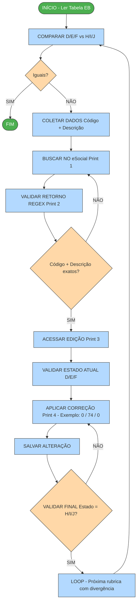

# Fluxograma — Processo de Validação e Correção de Rubricas no eSocial

> Recriado fielmente a partir das 2 imagens do SVG original (parte superior e parte inferior do fluxo).

---

## Diagrama Mermaid



---

## Fluxo em Texto (14 Etapas)

### PARTE 1 — Leitura e Comparação (Imagem SVG superior)

```
┌─────────────────────────┐
│   INÍCIO - Ler Tabela   │  ← Oval verde (início)
│           EB            │
└───────────┬─────────────┘
            │
            ▼
┌─────────────────────────┐
│  COMPARAR D/E/F vs      │  ← Retângulo azul (ação)
│        H/I/J            │
└───────────┬─────────────┘
            │
            ▼
        ◇ Iguais? ◇         ← Losango laranja (decisão)
       /           \
     NÃO           SIM
     /               \
    ▼                 ▼
┌──────────┐    ┌──────────┐
│ COLETAR  │    │   FIM    │  ← Oval verde (fim para esta rubrica)
│  DADOS   │    └──────────┘
│ Código + │
│ Descrição│
└────┬─────┘
     │
     ▼
┌─────────────────────────┐
│  BUSCAR NO eSocial      │  ← Print 1
│       (Print 1)         │
└───────────┬─────────────┘
            │
            ▼
┌─────────────────────────┐
│  VALIDAR RETORNO REGEX  │  ← Print 2
│       (Print 2)         │
└───────────┬─────────────┘
            │
            ▼
    ◇ Código + Descrição ◇   ← Losango laranja (decisão)
    ◇     exatos?        ◇
       /           \
     NÃO           SIM
     /               \
    │                 │
    └──► volta para   │
         BUSCAR       │
                      ▼
```

### PARTE 2 — Edição e Correção (Imagem SVG inferior)

```
                      │
                      ▼
┌─────────────────────────┐
│  ACESSAR EDIÇÃO         │  ← Print 3
│       (Print 3)         │
└───────────┬─────────────┘
            │
            ▼
┌─────────────────────────┐
│  VALIDAR ESTADO ATUAL   │  ← Ler valores D/E/F da tela
│        D/E/F            │
└───────────┬─────────────┘
            │
            ▼
┌─────────────────────────┐
│  APLICAR CORREÇÃO       │  ← Print 4 — Exemplo: 0 / 74 / 0
│  (Print 4)              │
│  Substituir D/E/F por   │
│         H/I/J           │
└───────────┬─────────────┘
            │
            ▼
┌─────────────────────────┐
│  SALVAR ALTERAÇÃO       │
└───────────┬─────────────┘
            │
            ▼
    ◇ VALIDAR FINAL       ◇  ← Losango laranja (decisão)
    ◇ Estado = H/I/J?     ◇
       /           \
     NÃO           SIM
     /               \
    │                 │
    └──► volta para   │
     APLICAR CORREÇÃO │
                      ▼
┌─────────────────────────┐
│  LOOP - Próxima rubrica │  ← Retângulo azul
│  com divergência        │
│  (volta para COMPARAR)  │
└─────────────────────────┘
```

---

## Legenda Visual (cores do SVG original)

| Forma          | Cor                      | Significado          |
| -------------- | ------------------------ | -------------------- |
| **Oval**       | Verde (#4CAF50)          | Início / Fim         |
| **Retângulo**  | Azul claro (#B3D9FF)     | Ação / Processamento |
| **Losango**    | Laranja/salmão (#FFD8A8) | Decisão (Sim/Não)    |
| **Seta**       | Preta                    | Fluxo sequencial     |
| **Seta curva** | Preta                    | Loop / Retorno       |

---

## Loops identificados no SVG

1. **Loop de Busca** (etapas 5→6→7→5): Se "Código + Descrição exatos?" = NÃO, volta para "BUSCAR NO eSocial"
2. **Loop de Correção** (etapas 10→11→12→10): Se "Estado final = H/I/J?" = NÃO, volta para "APLICAR CORREÇÃO"
3. **Loop Principal** (etapa 13→2): Após corrigir uma rubrica, volta para "COMPARAR D/E/F vs H/I/J" com a próxima rubrica

---

## Mapeamento Prints ↔ Etapas

| Print   | Etapa                                 | O que representa                                 |
| ------- | ------------------------------------- | ------------------------------------------------ |
| Print 1 | 5 - BUSCAR NO eSocial                 | Tela de busca com campo "Código da rubrica" = 11 |
| Print 2 | 6 - VALIDAR RETORNO REGEX             | Resultados: código 11 E código 110 (busca regex) |
| Print 3 | 8/9 - ACESSAR EDIÇÃO + VALIDAR ESTADO | Formulário com IRRF VAZIO (estado errado D/E/F)  |
| Print 4 | 10 - APLICAR CORREÇÃO                 | Formulário com IRRF = 74 (estado correto H/I/J)  |
